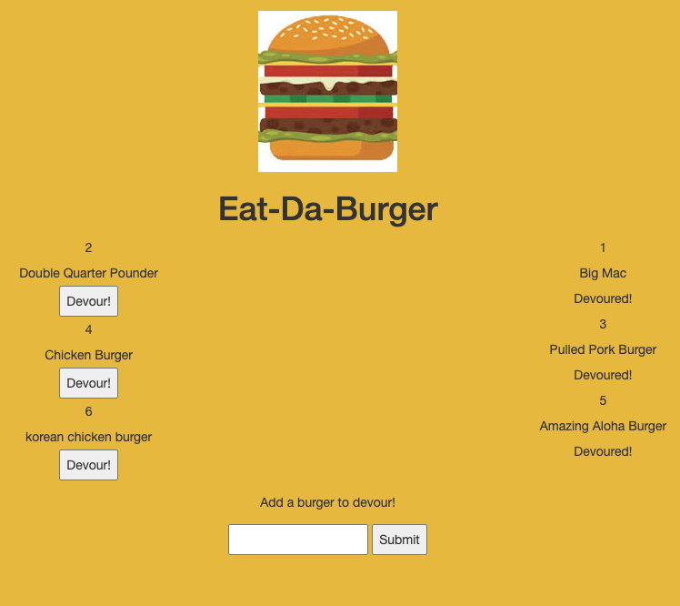

# EAT-DA-BURGER

Eat-Da-Burger is a like a restaurant app that let users save a burgers name and change the status of this burger as "devoured once they have tasted it.

Newly submitted burgers are on the "Devour" (left) side. It has a devour button below its name and when the user clicks it, it will be transferred on the the "Devoured" (right) side.

[Heroku Link](https://frozen-badlands-45842.herokuapp.com/)

## Installation

To get this application working, download and install express, express-handlebars and mysql. Express package needs to be required.  A database, table and fields needs to be created in mysql as well.

If everything was already set-up, you are now ready to start server by running node server.js in the terminal and after the connection was established you can visit the set localhost (http://localhost:3000/) from the browser

## Usage

